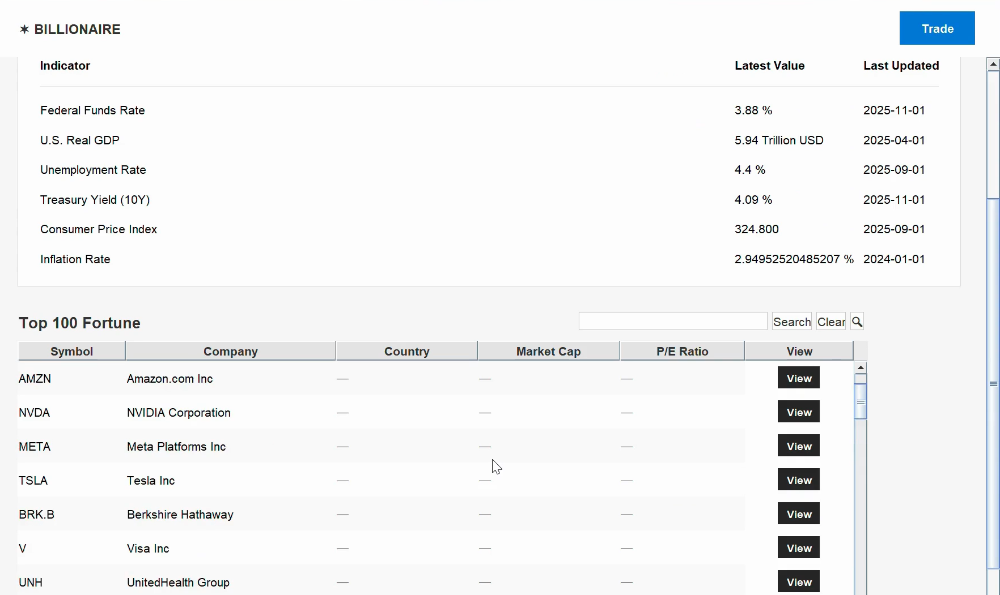
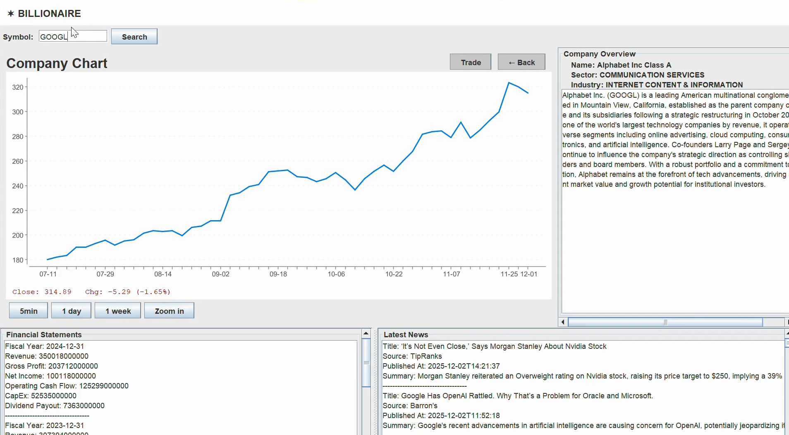
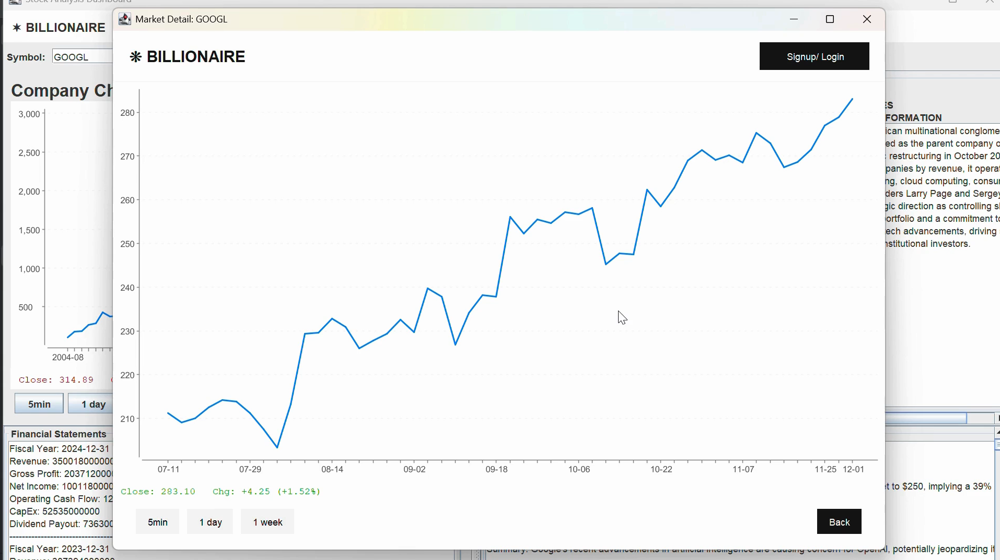
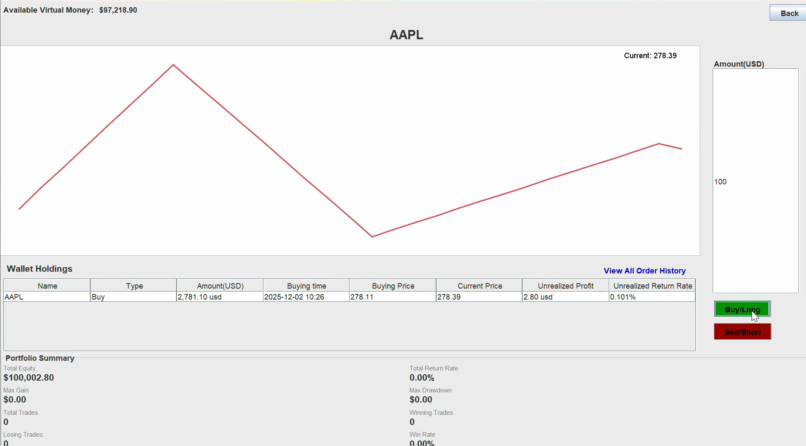
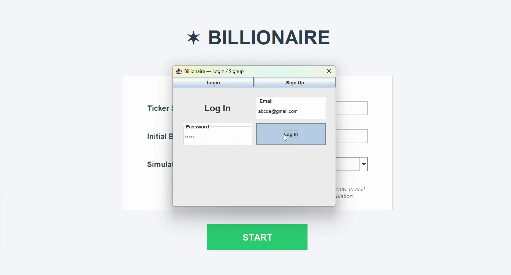
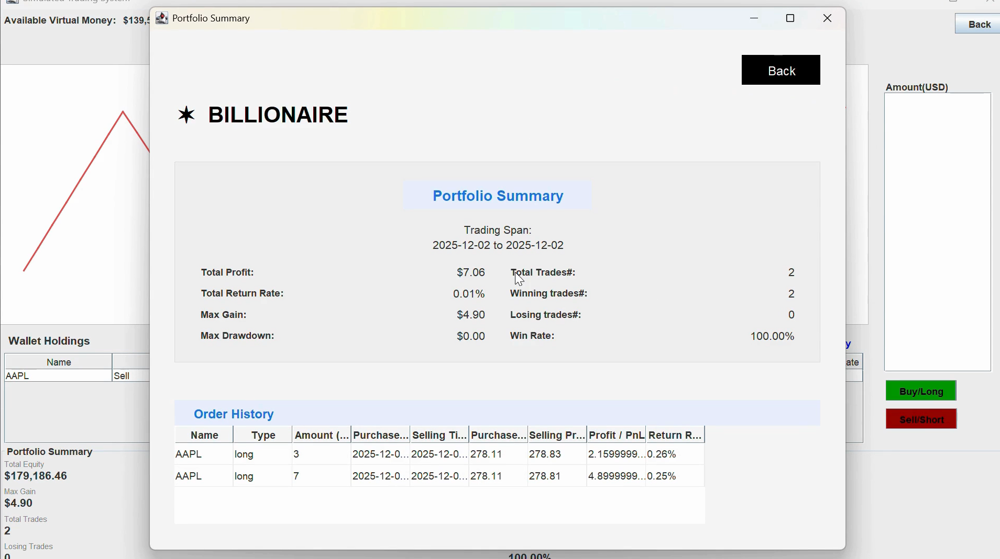

# BILLIONAIRE: Stock Analysis and Trading Simulation Platform

Please keep this up-to-date with information about your project throughout the term.

The readme should include information such as:
- a summary of what your application is all about
- a list of the user stories, along with who is responsible for each one
- information about the API(s) that your project uses 
- screenshots or animations demonstrating current functionality

By keeping this README up-to-date,
your team will find it easier to prepare for the final presentation
at the end of the term.

Billionaire is a comprehensive stock analysis and trading simulation platform designed to help users make informed investment decisions. The application provides real-time stock data, advanced analytics, and a simulated trading environment where users can practice their trading strategies without financial risk.

We built this application using Java, Javaswing for the GUI, and integrated various APIs for real-time stock data and news.

We have followed the clean architecture principles to ensure that our codebase is maintainable and scalable.
Each of our user stories is built in four layers: the Entity layer, the Use Case layer, the Interface Adapter layer, and the Frameworks & Drivers layer.
This structure aligns with the SOLID principles, promoting separation of concerns and enhancing code readability.
This approach allows us to easily manage dependencies, and facilitates future enhancements or modifications to the application.

## Features
### 1. Company Overview
Search for any stock symbol and instantly view:
- Company Name
- Sector
- Industry
- Description
- Market Statistics (Market Cap, EPS, PE Ratio, Dividend, Beta…)

---
### 2. Financial Statements
Retrieve and display up to 5 years of financial data, including:

- Total Revenue
- Gross Profit
- Net Income
- Total Assets & Liabilities
- Operating Cash Flow
- Capital Expenditures

---
### 3. News Aggregation
Fetch the latest company-related news directly from the API:
- Title
- Publisher
- Summary
- Timestamp
- Source

---
### 4. Stock Chart Viewer
Interactive candlestick chart with multiple intervals:

- **5 Minutes**
- **1 Day**
- **1 Week**

The chart updates dynamically based on selected intervals.

---
### 5. Cross-Page Linking
From the *Top 100 Companies* list:

- Clicking **View** automatically opens the **Company Details Page**
- Selected stock symbol auto-fills the search bar
- The system immediately loads the company’s data

---
### 6. Simulated Trading
Launch simulated trading directly from the Company Page:
- Buy/Sell shares using virtual money
- View live stock data before trading
- Track holdings & basic portfolio performance
- Zero financial risk (for training & practice)

## User Stories
1. As a user, I want to browse a list of the top 100 companies with their ticker symbols, sectors, and market capitalization so that I can choose which ones to analyze.
   - Keliu
2. As a user, I want to click on a company’s name and immediately view all its information, including an overview, financial statements, stock history, and related news, so that I can conveniently evaluate the company’s performance and access everything I need about the stock I’m interested in.
   - Charlotte
3. As a user, I want to select a time interval (daily, weekly, or monthly) when viewing a company’s price chart so that I can analyze short-term and long-term performance.
   - Mirror
4. As a user, I want to be able to sign up, login, logout to my account so that I am able to access simulated historical trading mode.
   - Muhammed
5. As a registered user, I want to choose a time period and use a simulated trading mode where I can buy and sell stocks with virtual money so that I can practice trading strategies without real financial risk.
   - Kasu
6. As a registered user, I want to track my simulated portfolio performance and realized/unrealized gains so that I can evaluate how my trading decisions perform over time.
   - Aditya

Noticed: these are just the main user stories that split between the team. There are additional smaller tasks and features that we have implemented to enhance the user experience.

## APIs Used
- Alpha Vantage API: Used for fetching real-time and historical stock data, including price history and financial statements.
- After reading the documentation and sample JSON outputs, each API function requires the following four components:
  - Base URL: The endpoint for the API requests.
  - Function Name: Specifies the type of data being requested (e.g., TIME_SERIES_DAILY, OVERVIEW, NEWS_SENTIMENT).
  - Parameters: Additional parameters such as stock symbol, interval.
  - API key 

 These are the functions that are used in our project:
#### Time Series Stock Data APIs
Used for generating candlestick charts, price history, and real-time updates.

- `TIME_SERIES_INTRADAY`
  - `TIME_SERIES_DAILY_ADJUSTED`
  - `TIME_SERIES_WEEKLY_ADJUSTED`
  - `GLOBAL_QUOTE`

#### Fundamental Data APIs
Used for company overview pages, financial statements, and stock evaluation metrics.

- `COMPANY_OVERVIEW`
  - `BALANCE_SHEET`
  - `INCOME_STATEMENT`
  - `CASH_FLOW`

#### Economic Indicators APIs
Used for macroeconomic analysis and context.

- `REAL_GDP`
  - `FEDERAL_FUNDS_RATE`
  - `CPI` (Consumer Price Index)
  - `INFLATION`
  - `UNEMPLOYMENT`
  - `TREASURY_YIELD`

#### Alpha Intelligence (News & Sentiment)
Provides market news filtered by ticker or keyword.

- `NEWS_SENTIMENT`

## DataBase Used
- Superbase: Used for user authentication and storing user portfolio data in the simulated trading environment.

## Clean Architecture
The whole project is structured following the Clean Architecture principles, which separates the code into four distinct layers:
- Entities (Core Business Rules)
- Use Cases (Application Business Rules)
- Interface Adapters (Controllers, Presenters, ViewModels)
- Frameworks & Drivers (Swing UI, API implementations)

Each module has:
- Input Data
- Output Data
- Interactor (Use Case)
- Presenter
- Controller
- Input Boundary
- Output Boundary
- Gateway Implementation (Alpha Vantage)

## Testing and Checkstyle
We have implemented unit tests for critical components of the application to ensure reliability and correctness.
- **Goal achieved: 100% test coverage for the Use Case and Entity layers.**

We also used Checkstyle to maintain code quality and adhere to coding standards throughout the project. 
- **Goal achieved: Zero Checkstyle violations across the entire codebase.**

## Screenshots
### Top 100 Companies Page

### Company Details Page

### Stock Chart Viewer

### Simulated Trading Interface

### User Authentication Page

### Portfolio Performance Tracking

